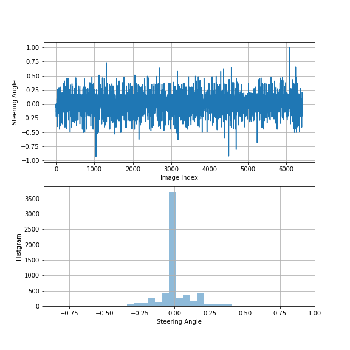
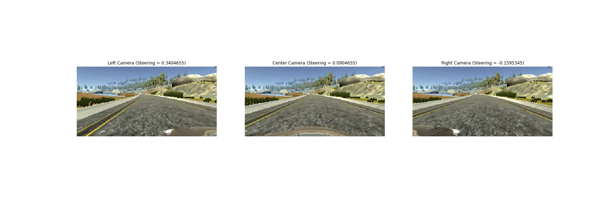
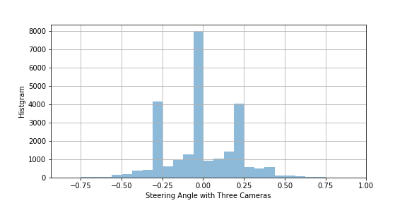
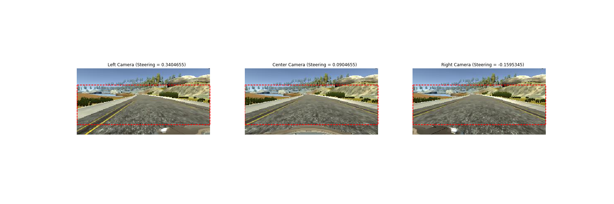
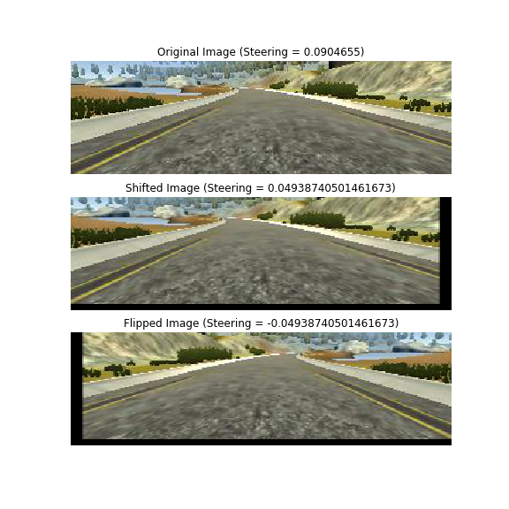
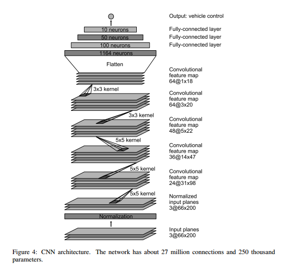
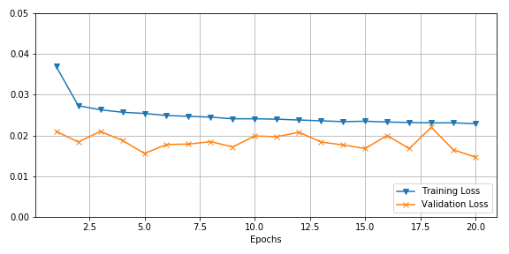

# **Project 3: Steering Behavioral Cloning**

### Project goal
The goal of this project is to define a convolutional neural network in Keras, and train it with collected camera images and steering angles obtained on Udacity simulator, and finally apply the trained model to clone the driving behavior and drive the car around track one without leaving the road

### Data Set Pre-processing and Augmentation 

#### 1. Data set exploration
I used the driving data set provided by Udacity for training and validation, since I was suffering from abrupt steering angle changing when I tried training mode on the simulator with keyboard control. The data set from Udacity has much smooth steering over time, and is considered as 'better' driving behaviors.

#### 2. Training and validation data set split
The original data set was split into training set (80%) and validation set (20%) with shuffling. 
*The size of training set is 6428 steering angles, corresponding to 6428x3 images from left, center and right cameras
*The size of validation set is 1608 steeering angles, corresponding to 1608x3 images from left, center and right cameras
In the training set, the steering angles over time, as well as angels histgram are illustrated below. The training set size is fairly small and may lead to over-fitting during training. Moreover, most of time, the steering angles are very close to ZERO. This could introduce certain bias to the training results, which tends to make the model prediction sticking to ZERO or very small steering. Several data pre-processing and data augmentation techniques are applied to help preventing such bias, as well as over-fitting


#### 3. Utilize all three cameras
Center camera can only provide on-road driving information, and won't help if the car gets close to road side and tries to re-enter center of road. Utilizing all three cameras (left, center, and right) images will get more information for training. The raw steering angles are associated with center camera images and need to be corrected for images from left and right cameras.  A steering correction factor of `+0.25` is used for left camera and `-0.25` is used for right camera. Images and corrected steering angles for three cameras in one frame are illustrated below.

To form the new training set, center camera images are used twice, and left/right camera images are used once. Therefore, the training set size is expanded to 4x large or 6428x4 = 25712 samples. The histogram of steering angles in expanded training set is shown below.

Please note this operation is only applied to training set. Validation set only use center camera images.

#### 3. Image cropping

The original image size is `160x320`. 25 pixels on bottom are removed, since they are mostly related to the hood. 40 pixels on top are removed as well, since they are about the sky and landscapes far away, and have little information about the road. After cropping, the image size become `95x320`. In the figure blow, red rectangle highlights the region of interest remaining after cropping, for left/center/right camera images.

Image cropping is applied to both training set and validation set, as well as `drive.py (line 64)`

#### 4. Image random shifting
In order to prevent over-fitting, and gain more information for road side recovery, training set augmentation is employed by randomly shifting images to up/down and left/right. Images can be shifted vertically by up to `+/-20` pixels, and horizontoally by up to `+/-50` pixels. Steering angles are modified accordingly. The steering angle change is proportional to horizontal shift. This function is attached below, and only applied to training set.

```python
def trans_image(image, steer, x_trans_range = 100, y_trans_range = 40):
    """
    Translation function provided by Vivek Yadav
    to augment the steering angles and images randomly
    and avoid overfitting
    """
    tr_x = x_trans_range*np.random.uniform()-x_trans_range/2
    steer_ang = steer + tr_x/x_trans_range*2*.2
    tr_y = y_trans_range*np.random.uniform()-y_trans_range/2
    Trans_M = np.float32([[1,0,tr_x],[0,1,tr_y]])
    image_tr = cv2.warpAffine(image,Trans_M,(np.shape(image)[1], np.shape(image)[0]))
    return image_tr,steer_ang
```

#### 5. Image flipping
Another method to augment the training set is flipping the image and reverse the steering angle. In the implementation, by 50% chance, flipped images are used for training. The piece of code is shown below. 

```python
num_random = np.random.randint(1)
if (num_random  == 0):# flip the image with 50% possibility
	image = np.fliplr(image)
	angle = -1*angle
```
The plots below shows original image (top),  randomly shifted image (middle), and further flipped image (bottom)


#### 6. Image resizing and normalization
Before going to CNN, images needs to be resized and normalized. 

```python
    def image_resize(img):
        import tensorflow as tf
        img = tf.image.resize_images(img, (66, 200)) # for Nvidia model
        return img
    model.add(Lambda(image_resize, input_shape = IMAGE_SHAPE))
    model.add(Lambda(lambda x: x/255.-0.5))
```
### Model Architecture

Two models are tested in this project. One is [Nvidia Model](http://images.nvidia.com/content/tegra/automotive/images/2016/solutions/pdf/end-to-end-dl-using-px.pdf), and the other is a simplified model similar to [Vivek Yadav's Post](https://chatbotslife.com/using-augmentation-to-mimic-human-driving-496b569760a9)

####1. Nvidia model
Nvidia model is depicted below. The input images are resized from `95x320` to `66x200`. The total trainable parameters are 501,819. Dropout is used heavily in this model to prevent over-fitting.



I trained Nvidia model with the augmented training set, and saved the training results to *.h5 file, and further tested the model on the simulator in autonomous mode. The car finished track one successfully, without leaving the road, but it doesn't finish track two.

###2. Simplified model [Final model]

To explore convolution neural network further, a more simple model was built later. The input images are resized from `95x320` to `64x64`, and less layers are used to reduce the trainable parameter size. Total trainable parameters in this model are 108,061. The model details are shown in the following table.

| Layer         		|     Description	        					|
|:---------------------:|:---------------------------------------------:|
| Input         		| 3x1x1, color space transform 							|
| Convolution 3x3     	| 1x1 stride, valid padding, outputs 62x62x64 	|
| ELU					|												|
| Max pooling	      	| 2x2 stride,  outputs 31x31x64				|
| Dropout	      	| dropout_prob = 0.5			|
| Convolution 3x3     	| 1x1 stride, valid padding, outputs 29x29x32 	|
| ELU					|												|
| Max pooling	      	| 2x2 stride,  outputs 14x14x32				|
| Dropout	      	| dropout_prob = 0.5			|
| Convolution 3x3     	| 1x1 stride, valid padding, outputs 12x12x16 	|
| ELU					|												|
| Max pooling	      	| 2x2 stride,  outputs 6x6x16				|
| Dropout	      	| dropout_prob = 0.5			|
| Flatten		| outputs 576  |
| Dense		| outputs 128  |
| ELU					|												|
| Dropout	      	| dropout_prob = 0.5			|
| Dense		| outputs 64  |
| ELU					|												|
| Dense		| outputs 16  |
| ELU					|												|
| Dense		| outputs 1 |

During training, Adam optimizer is used for both model. training loss and validation loss vs. epochs for the simplified model are illustrated below.


I tested the model on the simulator in autonomous mode. The car finished track one successfully, without leaving the road. However, it seems not as good as Nvidia model, especially when handeling sharp turns, shown in the image below. This simplified model is submitted as the final model. 

I also tried the model with track two. The car tracked the road for a while, before it went into the bushes at a sharp turn. One lap of training data from track two would be very helpful for driving in this track.

##### When driving with model.h5, please set the simulator to `640x480` for screen resolution, and `Fastest` for graphics quality.

### Summary

In this project, Nvidia model and one simplified CNN model are tested in behavioral cloning. After training with track one data provided by Udacity, both models can drive the car successfully on track one, but neither can finish track two. Data pre-processing and data augmentation turn to be very critical for large network when training with limited data set. 

---

